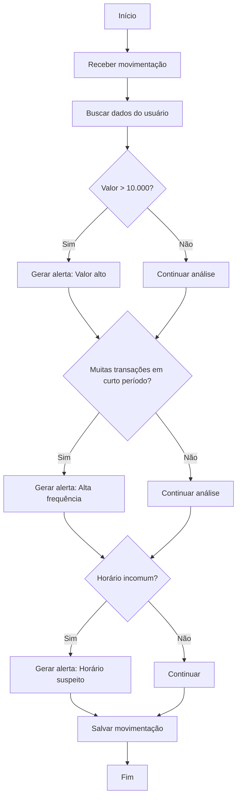

# Projeto JVISA 


# 📊 Fluxograma de Regras de Negócio — Sistema de Monitoramento Bancário

## 🎯 Objetivo

Este documento descreve o fluxo de decisão utilizado para identificar atividades suspeitas em movimentações financeiras dentro do sistema.

---

## 🔁 Fluxo Principal



---

## 🚨 Regras de Negócio

### 💰 Regra 1: Valor Alto

* Se o valor da transação for maior que R$10.000
* Ação: Gerar alerta automaticamente

---

### 🔁 Regra 2: Alta Frequência

* Se o usuário realizar mais de 5 transações em menos de 1 minuto
* Ação: Gerar alerta

---

### 🕒 Regra 3: Horário Incomum

* Se a transação ocorrer entre 00:00 e 05:00
* Ação: Gerar alerta

---

## 🧠 Observações Técnicas

* O sistema pode gerar múltiplos alertas para uma única transação
* As regras são independentes entre si
* O fluxo deve ser executado no backend (service layer)

---

## 🚀 Possíveis Evoluções

* Implementar score de risco por usuário
* Machine Learning para detecção de padrões
* Notificações em tempo real

---

## 📌 Exemplo de Implementação (Pseudo-código)

```csharp
if (valor > 10000)
    gerarAlerta("Valor alto");

if (transacoesUltimoMinuto > 5)
    gerarAlerta("Alta frequência");

if (hora < 5)
    gerarAlerta("Horário incomum");
```
