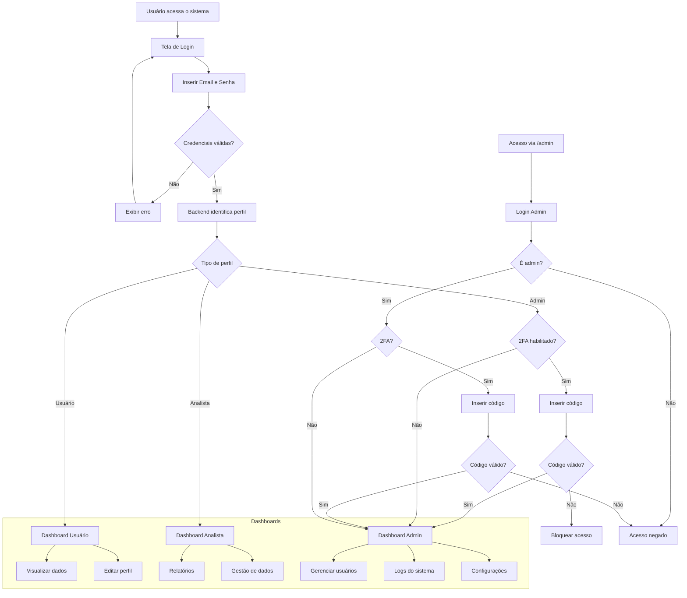

```mermaid

flowchart TD
A[Usuário acessa o sistema] --> B[Tela de Login]

B --> C[Inserir Email e Senha]
C --> D{Credenciais válidas?}

D -- Não --> E[Exibir erro]
E --> B

D -- Sim --> F[Backend identifica perfil]

F --> G{Tipo de perfil}

G -- Usuário --> H[Dashboard Usuário]

G -- Analista --> I[Dashboard Analista]

G -- Admin --> J{2FA habilitado?}

J -- Sim --> K[Inserir código]
K --> L{Código válido?}

L -- Não --> M[Bloquear acesso]
L -- Sim --> N[Dashboard Admin]

J -- Não --> N


subgraph Dashboards
H --> H1[Visualizar dados]
H --> H2[Editar perfil]

I --> I1[Relatórios]
I --> I2[Gestão de dados]

N --> N1[Gerenciar usuários]
N --> N2[Logs do sistema]
N --> N3[Configurações]
end


O[Acesso via /admin] --> P[Login Admin]

P --> Q{É admin?}

Q -- Não --> R[Acesso negado]

Q -- Sim --> S{2FA?}

S -- Sim --> T[Inserir código]
T --> U{Código válido?}

U -- Não --> R
U -- Sim --> N

S -- Não --> N


```