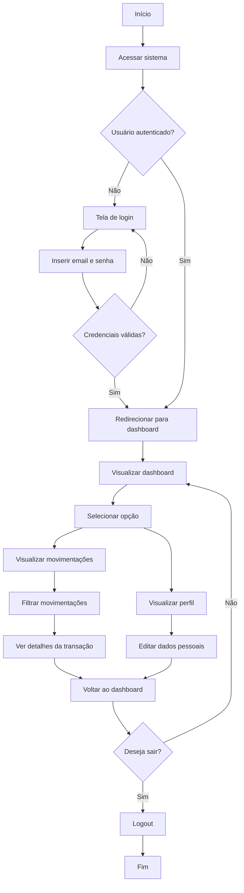
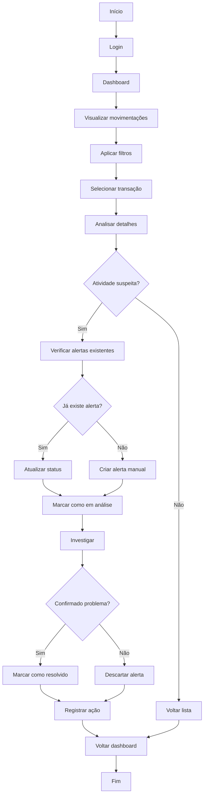
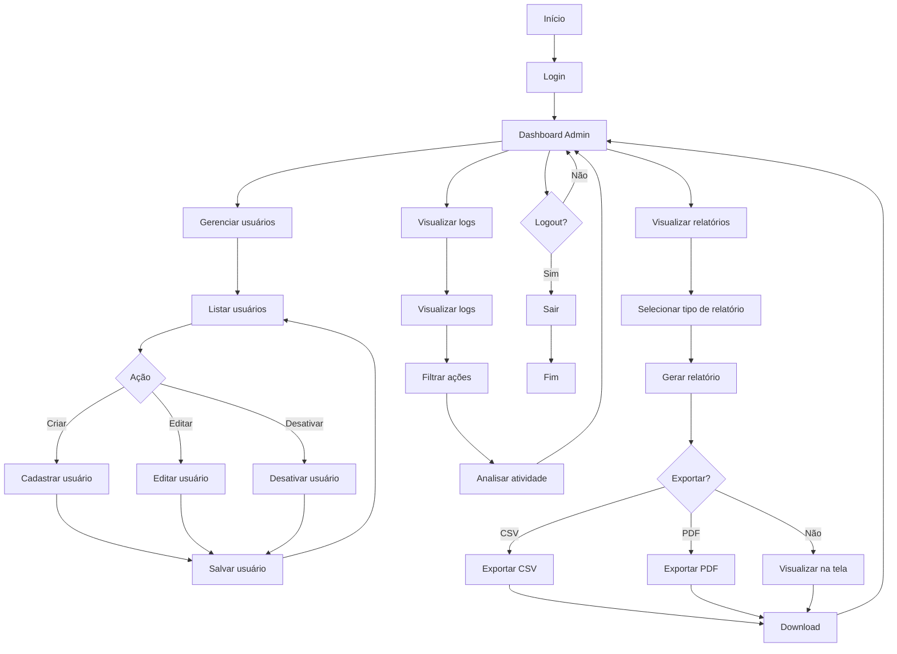
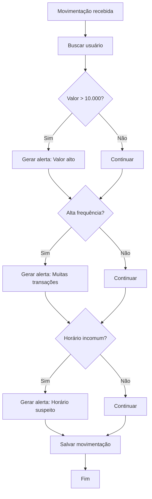

# 📊 Fluxogramas de Regras de Negócio — Sistema de Monitoramento Bancário

## 🎯 Objetivo
Documentar de forma detalhada os fluxos de interação dos diferentes perfis do sistema:
- Usuário
- Analista
- Administrador

---

# 👤 FLUXO — USUÁRIO (ACESSO E USO DO SISTEMA)

---

# 🧑‍💻 FLUXO — ANALISTA (MONITORAMENTO E ANÁLISE)

---

# 🛠️ FLUXO — ADMINISTRADOR (GESTÃO COMPLETA)

---

# 🚨 FLUXO — SISTEMA (GERAÇÃO DE ALERTAS AUTOMÁTICOS)

---

# 🧠 Observações Gerais

- Cada perfil possui permissões específicas (RBAC)
- O sistema pode gerar múltiplos alertas simultaneamente
- Todas as ações devem ser registradas em log
- Fluxos podem evoluir para eventos em tempo real

---

# 🚀 Próximos Passos

- Transformar fluxos em endpoints (API)
- Criar diagrama de arquitetura
- Implementar regras no back