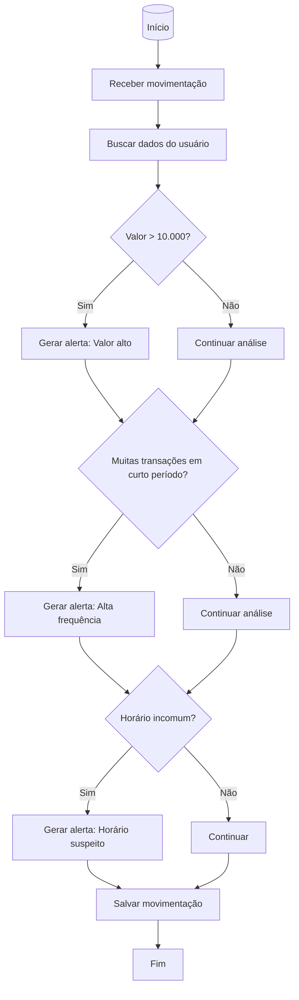

```mermaid
flowchart TD
    A[(Início)] --> B[Receber movimentação]
    B --> C[Buscar dados do usuário]

    C --> D{Valor > 10.000?}
    D -- Sim --> E[Gerar alerta: Valor alto]
    D -- Não --> F[Continuar análise]

    E --> G
    F --> G{Muitas transações em curto período?}

    G -- Sim --> H[Gerar alerta: Alta frequência]
    G -- Não --> I[Continuar análise]

    H --> J
    I --> J{Horário incomum?}

    J -- Sim --> K[Gerar alerta: Horário suspeito]
    J -- Não --> L[Continuar]

    K --> M
    L --> M[Salvar movimentação]

    M --> N[Fim]
```